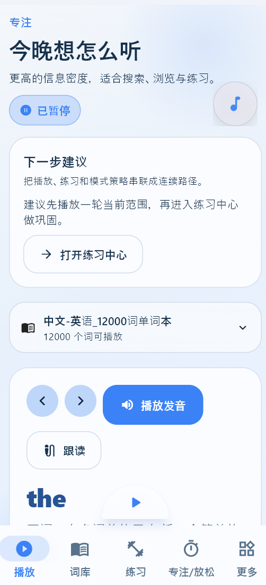
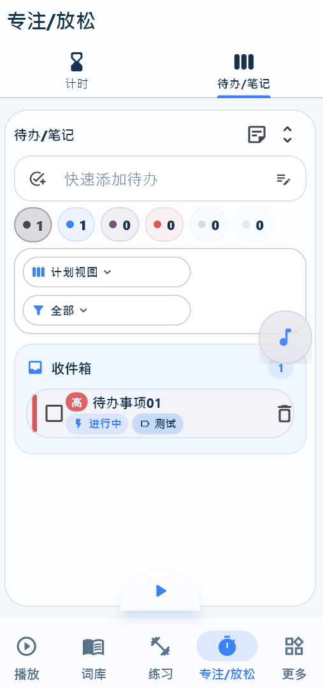
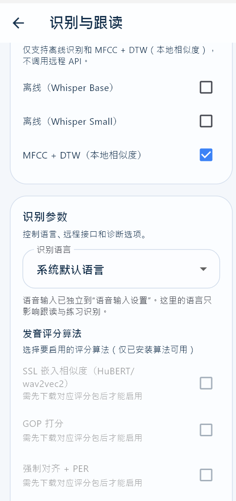

# 咸鱼声息 Flutter App


`咸鱼声息` 是一个围绕词汇学习、专注练习、白噪音助眠、语音输入与跟读训练构建的 Flutter 多平台应用。


当前工程已经统一了应用标识与打包命名：

| 项目 | 值 |
| --- | --- |
| 显示名称 | `咸鱼声息` |
| 组织标识 | `group.zn` |
| Android / Apple Bundle ID | `group.zn.xianyushengxi` |
| 桌面二进制名 | `xianyushengxi` |

## 核心能力

- 本地 SQLite 数据存储，支持词书、单词、设置、待办、练习记录等数据持久化
- 内置词书与自定义词书导入，支持 JSON / CSV / MDX 等格式
- 播放队列、TTS、环境音混音与专注场景
- 快速笔记、待办事项、天气与启动提示等移动端入口能力
- 跟读练习、语音识别、相似度评分与练习统计


## 快速开始

### 环境要求

- Flutter SDK
- Dart SDK（通常随 Flutter 自带）
- 对应平台的原生构建工具
  - Android: Android Studio / Android SDK
  - Windows: Visual Studio C++ Build Tools, CMake, NuGet
  - macOS / iOS: Xcode
  - Linux: GTK / clang / ninja 等 Flutter 桌面依赖

### 本地运行

```bash
flutter pub get
flutter run -d windows
```

Windows 下也可以直接使用辅助脚本：

```powershell
.\scripts\dev-run.ps1
```

常用参数：

- `-Clean`: 先执行 `flutter clean`
- `-ResetAppState`: 清理本地应用状态目录
- `-NoPubGet`: 跳过 `flutter pub get`
- `-NoRun`: 只准备环境，不启动应用
- `-Device windows|chrome|edge|android`: 指定运行设备
- `-RunRetry 2`: 当桌面进程锁文件时自动重试

查看最新日志：

```powershell
.\scripts\tail_app_log.ps1 -Follow
```

## 打包构建

项目已提供标准多平台打包脚本：

- PowerShell: `.\scripts\build.ps1`
- Bash: `./scripts/build.sh`

常见示例：

```powershell
.\scripts\build.ps1 -Target android-apk
.\scripts\build.ps1 -Target android-apk,android-appbundle,windows
.\scripts\build.ps1 -Target windows -BuildName 1.2.0 -BuildNumber 12
```

```bash
./scripts/build.sh --target android-apk
./scripts/build.sh --target android-appbundle --target linux
./scripts/build.sh --target macos --build-name 1.2.0 --build-number 12
```

构建产物会复制到 `dist/` 目录。更完整的主机支持矩阵、输出目录说明和已知限制请查看 [docs/BUILDING.md](docs/BUILDING.md)。

## 项目结构

当前工程已经按职责拆分为几层：

- `lib/main.dart`: 最小入口，仅负责启动应用
- `lib/src/app/`: 应用启动、依赖装配、根组件、品牌标识
- `lib/src/services/`: 数据库、TTS、ASR、提醒、环境音等服务
- `lib/src/state/`: `AppState` 及应用状态协调
- `lib/src/ui/`: 页面、组件、主题与布局
- `assets/`: 图标、环境音、词书等静态资源
- `scripts/`: 开发、日志和打包脚本
- `test/`: 自动化测试

更详细的目录说明请查看 [docs/PROJECT_STRUCTURE.md](docs/PROJECT_STRUCTURE.md)。


## 当前已知限制

- `web` 构建当前会被 `sqlite3` 与 `sherpa_onnx` 的 `dart:ffi` 依赖阻断，脚本已保留 Web 目标，但项目本身仍需后续做平台隔离。
- iOS 构建脚本默认使用 `--no-codesign`，适合 CI 产物输出，不包含签名与上架配置。
- 现有业务逻辑仍在持续演进中，本轮整理主要聚焦品牌统一、入口拆分、文档与构建工程化。

## 相关文档

- [docs/BUILDING.md](docs/BUILDING.md): 多平台构建与 `dist/` 产物说明
- [docs/PROJECT_STRUCTURE.md](docs/PROJECT_STRUCTURE.md): 工程目录与模块职责
- [MIGRATION_GUIDE.md](MIGRATION_GUIDE.md): 升级与本地数据清理指南








