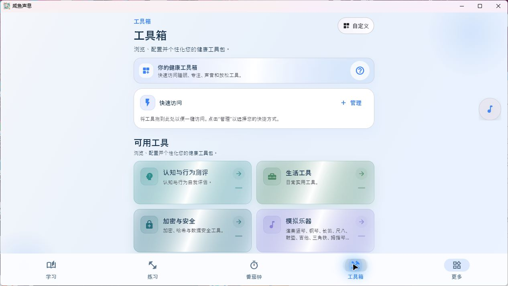

<p align="center"></p>

# 咸鱼声息 · Vocabulary Sleep App

把词汇学习、练习、专注、睡眠支持与日常工具放进一个本地优先的 Flutter 应用。你可以听词本、练习记忆、管理专注任务，也可以在工具箱里使用舒缓声音、呼吸训练、生活工具和加密工具；不需要的模块可以关闭。

[下载最新版本](https://github.com/yixunfei/vocabularySleep-app/releases/latest) · [更新记录](changelogs/CHANGELOG.md) · [提交问题](https://github.com/yixunfei/vocabularySleep-app/issues)

## 下载与平台

当前版本：**v1.0.1（build 2）**。本次发行提供 Android 与 Windows 安装产物。

| 平台 / 文件 | 使用方式 |
| --- | --- |
| Android · `arm64-v8a.apk` | 大多数现代 Android 手机优先选择此包 |
| Android · `armeabi-v7a.apk` | 适用于仍使用 32 位 ARM 系统的设备 |
| Android · `.aab` | 应用商店分发用，不能直接点击安装 |
| Windows x64 · `.zip` | 完整解压后运行 `xianyushengxi.exe`，保留同目录 DLL 和 `data` 文件夹 |
| Web | 仅有受限的平台入口与适配验证，不是完整应用，本次不发布 |
| iOS / macOS / Linux | 未纳入本次构建和发行验证 |

**Android 升级注意：v1.0.1 已更换签名证书，无法直接覆盖旧版 APK。请先在旧版中导出数据备份，再卸载旧版、安装新版并恢复备份；未备份的本地数据可能随卸载丢失。Windows 不受此签名变更影响。**

Windows 需要 [Microsoft Visual C++ x64 运行库](https://aka.ms/vc14/vc_redist.x64.exe)。若启动提示缺少 `MSVCP140.dll` 或 `VCRUNTIME140.dll`，请安装运行库后重试。

每次发布同时提供 `SHA256SUMS.txt`。升级前可在应用的数据管理中导出备份；语音模型、在线音频和部分工具数据需要联网下载。相机、定位、传感器、通知等功能取决于设备能力及系统权限。

## 可以做什么

| 主模块 | 当前能力 |
| --- | --- |
| 学习 | 词本浏览与导入、词条详情、字段播放配置、TTS 朗读、学习进度 |
| 练习 | 多题型练习、练习会话、错题、历史记录与记忆进度 |
| 专注 | 专注计时、待办、笔记、锁屏专注、提醒与环境音联动 |
| 工具箱 | 睡眠支持、声音与乐器、轻量游戏、注意力测试、日常决策、生活实用、加密安全 |
| 更多 | 模块启停、数据管理、语言、外观、语音和其他设置 |

### 睡眠与声音

- **睡眠助手**：睡眠评估与日志、睡前流程、夜醒支持、作息建议和报告。
- **声音工具**：舒缓音乐、乐器工具集、自由风铃、疗愈音钵、专注节拍、电子木鱼。
- **放松与注意力**：呼吸训练、静心念珠、禅意沙盘、舒尔特方格。
- 环境音支持在线目录、按需下载和本地缓存；已下载的有效资源可重复使用。

### 日常工具与互动

- **小游戏与人类测试**：数独、扫雷、拼图、五子棋、2048、消除游戏，以及反应、记忆、视觉、手眼协调等趣味测试。
- **每日决策**：吃什么、穿什么、去哪儿、干什么、随机助手与决策助手。
- **生活实用**：高级计算器、单位换算、日期和房贷计算、世界时钟、文本处理、二维码、图片处理、带壳截图、思维导图、城市与 Offer 对比等。
- **加密安全**：文本与文件加密、哈希校验、HMAC、非对称密码工具、密码生成与保管、OTP、秘密分享和媒体隐写。

工具箱首页支持拖拽排序、隐藏和恢复入口；首页布局与全局模块启停分别管理。不同工具的离线能力和硬件要求以具体页面为准。

### Windows 实机界面



## v1.0.1 更新重点

- 恢复默认 S3 资源的 **AWS SigV4 请求签名与 S3 Browser 请求头**，修复匿名访问被服务器拒绝的问题；普通用户无需配置环境变量。
- 修复环境音异步播放、目录刷新、资源下载与销毁期间的竞态，处理无效缓存和睡眠声音切换问题。
- 改进专注计时与待办时间来源、API key 安全存储及缓存路径校验。
- Android 改为 ARM64 / ARMv7 分包，减少只使用一种架构时的下载体积。
- 更新国际化文案、精简未使用 catalog key，并整理原生与 Web 平台入口。

详细修复与验证记录见 [CHANGELOG](changelogs/CHANGELOG.md)。

## 数据、联网与凭据

原生应用以 SQLite、本地文件和缓存存储学习记录及工具数据。大体积音频、采样音色和部分数据集按需获取，首次使用相关功能时需要网络。在线 TTS / ASR、地图和第三方服务也需要相应网络或配置；离线 ASR 需要本地模型。

默认资源服务器不支持匿名访问。客户端保留经资源所有者确认可分发的**只读凭据**，通过 HTTPS 和 SigV4 访问资源，不要求用户修改环境变量。客户端内置凭据可以被提取，服务端只读权限是实际权限边界；不能将写权限密钥放入客户端。

开发者可通过构造参数、已加载的 dotenv 或进程环境覆盖 `S3_ENDPOINT`、`S3_BUCKET`、`S3_REGION`、`S3_ACCESS_KEY_ID`、`S3_SECRET_ACCESS_KEY`、`S3_USER_AGENT`。配置参考 [.env.template](.env.template)。`.env` 不在默认发布资源清单中，移动端自定义配置需显式接入加载或依赖注入。

个人 TTS / ASR API key 使用系统安全存储，安全存储失败时不回落到明文设置；常规备份不会携带这些密钥。签名私钥和本机签名配置不进入版本控制。

## 本地开发

本次发行工具链：Flutter **3.44.1**、Dart **3.12.1**；Dart SDK 约束为 `^3.12.0`。

- Android：Android SDK、Command-line Tools、JDK；本次 compile / target SDK 为 36，最低 API 24，主机构建工具为 Build Tools 37、Java 21。
- Windows：Visual Studio 2022 的 C++ 桌面开发工作负载、Windows SDK、CMake、NuGet。
- 高级计算器 FJS / QuickJS 的 Windows 主机构建需要 x64 `libclang.dll` 和 Rust stable / Cargo；Android 还需要 `armv7-linux-androideabi`、`aarch64-linux-android` Rust targets。项目脚本检查 libclang，必要时通过 NuGet 引导到 `.tooling/libclang`；Android 构建会临时使用当前 NDK 的 Clang 标准头文件。

```powershell
git clone https://github.com/yixunfei/vocabularySleep-app.git
cd vocabularySleep-app
flutter pub get
flutter doctor -v

# 推荐入口：包含工具链和旧 CMake 路径缓存检查
.\scripts\dev-run.ps1 -Device windows

# Android：先连接设备或启动模拟器
flutter devices
flutter run -d <device-id>
```

工具链优先从 `FLUTTER_BIN` / `FLUTTER_ROOT`、`ANDROID_HOME` / `ANDROID_SDK_ROOT`、`CMAKE_BIN` / `CMAKE_ROOT`、`LIBCLANG_PATH` 和 `NUGET_BIN` 等本机配置解析，再查找 PATH 与项目内工具目录。不需要在源码中硬编码个人路径。

## 构建发行产物

```powershell
.\scripts\build.ps1 -Target windows -BuildName 1.0.1 -BuildNumber 2
.\scripts\build.ps1 -Target android-apk,android-appbundle -BuildName 1.0.1 -BuildNumber 2
```

产物目录为 `dist/windows/`、`dist/android-apk/` 和 `dist/android-appbundle/`。APK 使用 `--split-per-abi --target-platform android-arm,android-arm64`；Windows 发行需要压缩完整输出目录。

Android release 必须配置正式签名。将以下配置保存在被 Git 忽略的 `android/key.properties` 中，其中 `storeFile` 相对 `android/app/` 解析：

```properties
storeFile=vocabularySleep-release-20260915.jks
storePassword=<本机密钥库密码>
keyAlias=<签名密钥别名>
keyPassword=<私钥密码>
```

也可通过 Gradle properties 或环境变量提供 `RELEASE_STORE_FILE`、`RELEASE_STORE_PASSWORD`、`RELEASE_KEY_ALIAS`、`RELEASE_KEY_PASSWORD`。为保持已安装 APK 的覆盖升级能力，后续版本必须使用相同签名身份；保存好 JKS 和密码备份。

Web 平台适配可以单独运行 `flutter build web --no-wasm-dry-run` 验证，但数据库仅在会话内存中保存，ASR 明确不可用，完整功能尚未迁移。发行脚本继续禁用 Web 目标。

## 测试与国际化

```powershell
flutter test --no-pub
flutter analyze --no-pub
node scripts/audit_i18n_placeholders.js
node scripts/maintain_i18n_catalog.js --limit 20

# 定向测试示例
.\scripts\test.ps1 -Target test/cstcloud_s3_auth_test.dart
.\scripts\test.ps1 -Target test/ui_smoke_test.dart
```

文案统一由 `lib/l10n/catalog/app_texts.csv` 与 `app_text_registry.json` 管理，运行时通过 `AppI18n.t(...)` 获取。维护语言为中文、英文、日文、德文、法文、西班牙文和俄文；动态参数使用 `{name}`。新增或调整 key 时同步七语言资源及 registry，并执行占位符审计；日常维护报告不会自动删除历史 key。

## 代码组织

```text
lib/
  main.dart / main_native.dart / main_web.dart  平台入口
  src/app/                                    启动装配与依赖注入
  src/core/module_system/                     模块注册、启停与访问守卫
  src/models/、repositories/                   数据模型和仓储
  src/services/                               数据库、音频、TTS、ASR、缓存及工具服务
  src/state/                                  应用与各领域状态
  src/ui/                                     页面、组件与主题
  src/i18n/、l10n/catalog/                     国际化入口与文案源
assets/                                       品牌、词本与工具资源
android/、windows/                            本次发行平台工程
scripts/                                      开发、构建、校验和资源维护脚本
test/                                         单元、Widget 与回归测试
third_party/                                  本地维护的平台插件修补
changelogs/                                    历史变更
```

核心技术包括 Provider / ChangeNotifier、部分 Riverpod、SQLite、audioplayers、flutter_tts、sherpa_onnx、FJS / QuickJS、flutter_map 和 flutter_secure_storage。`third_party/` 中的音频、TTS、文件选择、MIDI 等 override 属于当前构建依赖，升级时需要保留或验证相应平台修补。

模块 ID 与父子关系集中在 `module_id.dart` / `module_registry.dart`；运行时及 UI 路由守卫统一执行禁用策略。新功能应按领域拆分服务、状态和展示，避免在页面中堆积业务逻辑。

## 贡献与许可

提交问题时请附应用版本、操作系统、复现步骤和脱敏日志。开发前阅读 [项目说明](PROJECT_DOMAIN.md)、[模块说明](modules/README.md) 和 [变更记录](changelogs/CHANGELOG.md)。本地协作规范、设计规范和计划记录分别保存在 `AGENTS.md`、`docs/`、`plans/`，部分为本地工作材料。

项目源码采用 [MIT License](LICENSE)。第三方依赖、媒体与数据集保留各自的许可证和使用条件。
