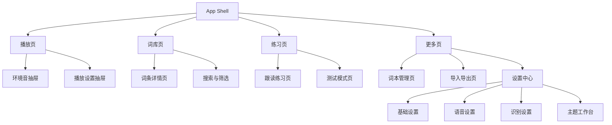

# Vocabulary Sleep Flutter 重构落地方案（移动端 UI/UX）

更新时间：2026-03-10

## 1. 文档目的

本文档用于明确 `flutter_app` 的下一阶段产品与界面重构方向，将当前已有的 Flutter 能力沉淀为一套适合移动端使用的产品方案。文档目标不是讨论单个控件或零散视觉调整，而是为整个应用建立统一的产品定位、信息架构、页面职责、交互策略、视觉体系、工程拆分方式以及分阶段实施路径。

当前项目已经完成了本地数据库、词本导入导出、TTS 播放、环境音、测试模式、ASR 跟读、外观配置等关键能力，但这些能力目前主要集中在单一页面中表达，导致移动端体验呈现为“功能完整但结构过重、入口过密、主场景不突出”。因此，本轮方案的核心不是补功能，而是进行一次以移动端体验为中心的信息架构与界面壳层重构。

本文档默认服务三类协作者：产品负责人、UI/UX 设计师、Flutter 开发者。产品负责人可以用它判断优先级和范围，设计师可以据此产出视觉稿和交互稿，开发者可以据此拆分模块、安排迭代和落地实施。

## 2. 项目现状复盘

### 2.1 已有能力概览

从当前工程实现看，以下能力已经具备可用基础：

- 本地 SQLite 数据能力，支持词本、词条、设置存储。
- 内置词本灌库与 JSON / CSV / MDX 导入。
- 收藏词本、任务词本、词条 CRUD。
- 搜索、模糊搜索、字母跳转、前缀跳转。
- TTS 播放、播放队列、语音配置。
- 环境音混音、音量控制、自定义音频导入。
- 测试模式、跟读、ASR、多引擎配置、离线模型下载。
- 外观配置、主题预设、自定义视觉参数。

这说明当前应用的“能力内核”并不弱，尤其是 `AppState`、`PlaybackService`、`AmbientService`、`SettingsService`、`AppDatabaseService` 等已经承担了明确职责，为后续 UI 重构提供了稳定基础。

### 2.2 当前工程健康度

在本次评估过程中，工程层面的结论如下：

- `flutter analyze` 通过。
- `flutter test` 通过。
- 逻辑层具备一定测试覆盖，尤其是搜索跳转、发音评分、设置持久化等核心能力。

这意味着当前项目不存在必须先大规模修复底层错误才能推进重构的问题。换言之，下一阶段可以以“重构 UI 壳层和页面结构”为主，不必优先重写业务逻辑。

### 2.3 当前 UI/UX 的主要问题

当前体验问题主要不是功能缺失，而是功能组织方式不适合移动端：

第一，主界面承载了过多模式。当前 `HomePage` 同时承担了播放、词库切换、词条阅读、搜索跳转、测试模式、跟读、环境音、设置、导入和外观配置等能力，页面职责严重混合。结果是用户难以快速判断“我现在是在听词、查词、练习，还是在管理应用”。

第二，移动端入口结构仍然带有明显桌面思维。桌面端可以接受左侧侧栏加右侧详情区的布局，但移动端并没有真正建立独立的信息架构。当前在窄屏时直接保留详情面板，而搜索、字母跳转、前缀跳转等能力仍依赖侧栏逻辑。移动端 `Drawer` 更多承担词本列表和管理，而不是核心浏览入口，这会导致用户在手机上进行搜索或跳转时缺少清晰路径。

第三，主操作层级不清。单词详情头部同时放置编辑、跟读、任务、收藏、删除等多种操作；底部还有悬浮播放条；右下角又有环境音、设置、返回顶部等浮动操作。这些入口都具备较强视觉权重，但缺少明确的主次关系，导致界面持续处于“可操作但不聚焦”的状态。

第四，设置与配置入口过重。设置页中已经接入了播放、语音、ASR、外观、主题、自定义颜色、动态效果、背景图等大量能力，但这些能力在产品层尚未分层，普通用户会感受到过高的理解负担，高级用户也难以建立稳定心智模型。

第五，弹窗体系仍是桌面优先。加词、设置、环境音等均采用固定宽高的大 `Dialog` 承载。这一实现方式虽然在桌面上可接受，但在移动端会显著降低浏览连续性、关闭效率和单手操作友好性。

第六，视觉系统方向尚未明确。当前应用已经具备丰富外观能力，但默认主题和界面组织仍偏工具型与配置型，尚未明确落在“助眠沉浸”还是“高效专注”之上。视觉语言、动效、层次与产品主场景之间的关系还不够稳。

### 2.4 结论

基于现状，可以得出一个明确结论：当前阶段最需要的不是继续堆叠能力，而是围绕移动端使用场景，对产品主路径、页面架构和视觉表达进行系统性收敛。

## 3. 重构目标

### 3.1 产品目标

本轮重构的产品目标如下：

- 让用户在首次打开应用时能够在 3 秒内理解“这个应用主要是用来听词和练习的”。
- 让高频操作在手机上能够被单手完成，且无需依赖深层弹窗。
- 让播放场景成为默认主场景，词库与练习作为清晰的次级场景存在。
- 让高级配置仍然可用，但不打扰普通用户的核心路径。
- 为后续继续补充睡眠模式、专注模式、练习统计、主题预设等能力建立稳定承载结构。

### 3.2 体验目标

本轮重构的体验目标如下：

- 降低认知负担，减少首页同时出现的高权重操作数量。
- 提升移动端连续性，避免频繁切换固定大弹窗。
- 提升默认视觉完成度，让产品看起来像一个“有明确主场景的移动应用”，而不是“功能集合页”。
- 提升可维护性，使未来页面与组件可以独立演进。

### 3.3 工程目标

本轮重构的工程目标如下：

- 将超大 `HomePage` 拆解为壳层、页面、组件和面板四个层级。
- 保持 `AppState` 与现有 services 的主要职责不变，优先做界面层重构。
- 将主题与外观配置逐步上提到应用级，而不是仅由首页局部驱动。
- 为后续新增功能保留稳定模块边界，避免继续扩大单文件复杂度。

## 4. 产品策略与定位

### 4.1 核心定位

产品应被定义为“移动端词汇助眠与专注播放应用”，而不是“词库管理器”。

这一定义有三个关键含义：

- 应用的默认打开场景应该是播放场景。
- 应用的视觉主语应该是“沉浸、轻压、稳定”，而不是“功能台、配置台、管理台”。
- 词库管理和高级配置重要，但不是首页叙事中心。

### 4.2 双主场景策略

产品长期应围绕两个高频场景展开：

- 助眠听词：强调播放、定时、环境音、低刺激视觉、少干扰操作。
- 专注学习：强调查词、练习、跟读、搜索和较高信息效率。

这两个场景不是两个不同产品，而是同一个应用内的两种预设模式。应用需要在信息架构一致的前提下，让默认主题、默认组件权重和默认交互更贴合场景。

### 4.3 用户分层

当前产品隐含着三类用户：

- 轻用户：只想导入词本后直接播放、听词、收藏，不愿研究复杂配置。
- 学习型用户：需要搜索、查看释义、加入任务、测试、跟读。
- 高级用户：愿意调 TTS、ASR、离线模型、主题和字段样式。

当前版本的问题是对三类用户几乎使用了同一套界面入口，导致每类用户都在为其他人的需求承担复杂度。新方案必须通过结构分层来解决这个问题。

## 5. 总体信息架构

### 5.1 一级导航结构

建议采用移动端底部导航的四页结构：

1. `播放`
2. `词库`
3. `练习`
4. `更多`

这四页结构有清晰分工：

- `播放` 承接默认主场景。
- `词库` 承接浏览和查找。
- `练习` 承接主动学习。
- `更多` 承接低频配置和管理动作。

若在第一阶段希望降低实施复杂度，也可以先采用三页结构：

1. `播放`
2. `词库`
3. `更多`

同时将 `练习` 暂时挂在 `词库详情` 内部，以后再独立。即便如此，也要确保未来可平滑扩展到四页结构。

### 5.2 全局能力挂载原则

以下能力不应再作为首页零散浮动按钮存在，而应有明确挂载位置：

- 环境音：挂载到播放页的底部抽屉和快捷入口。
- 设置：挂载到更多页。
- 跟读：挂载到练习页和词条详情页。
- 搜索与跳转：挂载到词库页。
- 词本管理：挂载到更多页中的词本管理。
- 导入导出：挂载到更多页中的数据管理。

### 5.3 页面关系图



## 6. 页面详细方案

### 6.1 播放页

#### 页面目标

播放页是默认首页，目标是让用户无需理解复杂结构即可开始使用。页面设计应始终回答三个问题：

- 我现在正在播放哪个词本？
- 我现在播放到了哪里？
- 我下一步最自然的动作是什么？

#### 页面结构

建议自上而下分为五个区域：

1. 顶部状态区
2. 当前词主卡
3. 播放进度与模式区
4. 固定播放器
5. 补充快捷入口

#### 顶部状态区

顶部状态区只放以下信息：

- 当前词本名称
- 当前模式标签，例如“助眠”或“专注”
- 词本切换入口

不再在这里放全局设置、语言切换、过多操作按钮。语言与更完整设置统一移到更多页中，播放页只保留播放相关语义。

#### 当前词主卡

主卡是播放页的核心视觉焦点。建议包含：

- 当前单词
- 当前释义
- 可选示例句
- 当前播放序号与总词数
- 收藏按钮
- 加入任务按钮

默认不在这里放编辑和删除。编辑、删除属于管理动作，不应干扰主阅读卡片。

对“助眠”模式，默认展示更少信息，突出单词和释义。对“专注”模式，可以多展示例句和字段扩展内容。

#### 播放进度与模式区

建议紧贴主卡下方展示：

- 播放进度条
- 当前单词在词本中的位置
- 起始位置选择
- 顺序 / 随机播放
- 文本显隐

此区域是播放模式调度区，适合用横向卡片或轻量分段开关，不适合继续塞在复杂悬浮条里。

#### 固定播放器

播放器应采用常驻底部的固定区域，不随滚动自动隐藏。播放器内仅保留高频控制：

- 上一个
- 播放 / 暂停 / 继续
- 下一个
- 当前播放状态

不建议将设置、环境音、测试模式放入同一层级。播放器的核心任务是稳定控制，而不是承载所有入口。

#### 播放页快捷入口

快捷入口建议采用最多三个小入口：

- 环境音
- 定时停止
- 跟读或练习

这些入口可以做成圆角按钮行，也可以合并成一个“更多播放工具”入口。

### 6.2 词库页

#### 页面目标

词库页承担“搜索、浏览、筛选、切换词本、查看词条”的任务，是应用的内容入口，而不是管理入口。

#### 页面结构

建议分为四个区域：

1. 搜索栏
2. 筛选与切换区
3. 词条列表
4. 词条详情页

#### 搜索栏

顶部固定搜索栏，应支持：

- 输入即搜
- 搜索模式切换：全部 / 单词 / 释义 / 模糊
- 清空搜索

当前侧栏中的搜索和模式切换逻辑可整体迁移过来，但视觉上必须成为移动端一等入口，而不是辅助区块。

#### 筛选与切换区

建议将词本切换、收藏筛选、任务筛选、字母跳转集中为一个横向可滚动的筛选区或展开式工具栏，而不是继续占据整块侧栏高度。

字母跳转在移动端不建议默认完整展开 26 个字母按钮，可改成：

- 抽屉式字母索引
- 可滚动字母条
- 长按快速跳转面板

前缀跳转可保留，但应并入搜索区，不必作为独立大块输入区长期占位。

#### 词条列表

词条列表应成为词库页的主体。每个列表项建议包含：

- 单词
- 简短释义预览
- 收藏状态
- 任务状态
- 快速试听按钮

列表项不建议再挂过多管理动作。管理行为统一进入详情页或更多菜单。

#### 词条详情页

词条详情页建议采用独立页面，分为两种状态：

- 阅读态：查看单词、释义、例句、扩展字段、试听、收藏、加入任务、进入练习。
- 操作态：编辑字段、删除词条、管理展示字段。

阅读态是默认态，操作态通过右上角 `更多` 菜单进入。这是本轮重构的重要原则之一。

### 6.3 练习页

#### 页面目标

练习页承担主动学习闭环，让当前的测试模式和跟读能力从“功能入口”提升为“独立学习场景”。

#### 页面结构

建议至少提供三个入口卡片：

- 当前词本练习
- 错词回看
- 跟读练习

如果一期资源有限，可先保留两个核心入口：

- 测试模式
- 跟读练习

#### 测试模式

当前的测试模式是一个隐藏字段的局部状态，建议改造成完整练习页：

- 顶部显示练习范围与进度
- 中间显示词条题面
- 底部显示“显示提示”“显示答案”“下一个”

测试模式的体验目标是让用户明确自己进入了练习状态，而不是在普通阅读态上被动切换一个隐藏逻辑。

#### 跟读练习

跟读目前通过 `AlertDialog` 打开，应重构为独立练习页或全屏抽屉。页面建议包含：

- 目标词
- 参考发音播放
- 录音按钮
- 实时进度或识别进度
- 结果卡片
- 再试一次

ASR 提供商、离线模型、评分方法等高级选项默认收起，仅在“高级设置”中出现。普通用户更关注的是“能不能练”和“练得怎么样”，而不是底层引擎组合。

### 6.4 更多页

#### 页面目标

更多页承担所有低频、高复杂度、跨场景的管理功能，是应用的配置中心和运维中心。

#### 一级入口建议

更多页建议提供以下分组：

- 词本管理
- 数据管理
- 播放与语音设置
- 识别与跟读设置
- 主题与外观
- 关于与帮助

#### 词本管理

这里承接原有 Drawer 中的：

- 新建词本
- 重命名词本
- 删除词本
- 合并词本
- 特殊词本导出

词本管理页中允许存在更多动作，因为用户已经明确进入管理场景。

#### 数据管理

这里承接：

- 导入词本
- 导入旧数据库
- 导出任务词本
- 清空任务词本

所有较重的数据操作都应统一具备忙碌态、进度态和完成态反馈。

#### 设置中心

更多页进入设置中心后，再拆为四个层级：

1. 基础设置
2. 语音设置
3. 识别设置
4. 主题工作台

其中基础设置应优先暴露普通用户最常用的项目，例如语言、默认播放方式、是否显示文本、音量、语速等。

## 7. 视觉与界面系统方案

### 7.1 默认双主题策略

本轮不建议继续把外观系统直接暴露成“一个开放参数面板”，而应先建立两个官方默认主题：

- `Sleep`
- `Focus`

这两个主题可以建立稳定的品牌感和场景感，让用户先得到成熟体验，再决定是否进入高级定制。

### 7.2 Sleep 主题

Sleep 主题应服务夜间使用和低刺激场景，建议具有以下特征：

- 深色或近深色背景
- 柔和青灰或蓝绿作为强调色
- 卡片对比适中，不过度明亮
- 动效节制，避免高频闪烁
- 播放器稳定突出
- 文本显隐与环境音入口比练习入口更靠前

### 7.3 Focus 主题

Focus 主题应服务白天学习和高可读场景，建议具有以下特征：

- 浅色背景与清晰层级
- 对比更高
- 内容密度略高于 Sleep
- 搜索、列表、练习入口更清晰
- 保留适度强调色，但避免工具后台感

### 7.4 主题工作台的定位

当前项目已有较强的外观能力，这些能力不应删除，而应重新定位为“高级工作台”，只在用户主动进入时出现。工作台可保留以下功能：

- 主题切换
- 自定义背景图
- 自定义颜色
- 字体和字号
- 卡片透明度
- 字段样式
- 高级特效

但必须引入两个原则：

- 默认不打扰普通用户。
- 高风险或高噪声效果默认关闭。

### 7.5 动效策略

当前已有 `flowingEffect`、`breathingEffect`、`marqueeText`、`rainbowText`、`randomEntryColors` 等能力。这些能力可以保留，但需要重新定义动效等级：

- 一级动效：轻微过渡、页面切换、按钮状态变化、进度更新。默认开启。
- 二级动效：呼吸感、背景轻微流动。仅在特定主题或设置中开启。
- 三级动效：彩虹字、跑马灯、随机色。归入实验性外观设置，默认关闭。

从产品体验角度看，助眠类产品应特别注意“稳定”和“低干扰”。因此，动效能力不能以“越多越炫”为目标，而应服务情绪和节奏。

### 7.6 视觉 Token 建议

建议将未来视觉系统统一抽象为以下 Token：

- 颜色：背景、前景、强调、边框、危险、成功、弱文本。
- 圆角：页面卡片、列表项、按钮、底部抽屉、弹窗。
- 间距：页面级、区块级、卡片级、组件内边距。
- 阴影：弱、中、强三档。
- 动效：时长、曲线、是否允许动画。
- 字体：标题、正文、辅助文案、数字样式。

`LegacyStyle` 可以在过渡期继续承担适配职责，但长期建议逐步转换为标准化主题 Token 层。

## 8. 组件系统方案

### 8.1 核心组件

建议沉淀以下核心组件，避免每个页面重复拼装：

- `MiniPlayer`
- `WordCard`
- `WordRow`
- `WordbookSwitcher`
- `ModeSegment`
- `SectionHeader`
- `StatusBadge`
- `SettingTile`
- `ActionSheetHeader`
- `BusyOverlay`
- `EmptyStateView`
- `ErrorStateView`

### 8.2 MiniPlayer

MiniPlayer 作为全局播放器组件，应具备以下特点：

- 固定高度
- 控件数量有限
- 能在所有一级页面稳定显示
- 不依赖滚动行为决定是否隐藏
- 可向上展开为完整播放控制面板

### 8.3 WordCard

WordCard 是播放页和详情页的核心组件，建议支持以下状态：

- 简版：单词 + 释义
- 扩展版：单词 + 释义 + 例句 + 扩展字段
- 练习版：隐藏答案、展示提示

通过统一组件状态，而不是分散在各处用条件判断控制，可显著降低页面复杂度。

### 8.4 SettingTile 系列

设置页建议统一采用三种 tile：

- 开关型
- 下拉型
- 滑杆型

这样既方便视觉统一，也便于后续继续扩展设置项。

## 9. 技术实施方案

### 9.1 目录拆分建议

建议将当前超大页面拆分为以下结构：

```text
lib/
  src/
    ui/
      app_shell.dart
      pages/
        play_page.dart
        library_page.dart
        practice_page.dart
        more_page.dart
        word_detail_page.dart
        settings_page.dart
      widgets/
        mini_player.dart
        word_card.dart
        word_row.dart
        wordbook_switcher.dart
        busy_overlay.dart
        empty_state_view.dart
      sheets/
        ambient_sheet.dart
        playback_sheet.dart
        import_sheet.dart
        quick_actions_sheet.dart
      theme/
        app_theme.dart
        app_tokens.dart
        appearance_adapter.dart
```

### 9.2 状态与逻辑保留策略

本轮重构建议尽量保留现有：

- `AppState`
- `PlaybackService`
- `AmbientService`
- `SettingsService`
- `AppDatabaseService`

重构重点在于：

- 将视图状态从 `HomePage` 内部分散变量中迁移到页面级局部状态。
- 将页面导航、弹窗开关、当前底部 tab 等交给新的 `AppShell` 管理。
- 保留业务状态在 `AppState` 中，避免一次性重构过大。

### 9.3 主题系统调整

当前外观系统已具备基础，但建议做如下调整：

- `LegacyStyle.applyAppearance()` 从首页 build 阶段迁出。
- 在 `MaterialApp` 或更上层统一读取 `config.appearance`。
- 将 app-level 主题、页面级视觉和组件级样式使用同一套 source of truth。

这样可以避免出现“应用主题”和“页面视觉”不同步的问题。

### 9.4 弹窗与页面的迁移原则

从当前实现出发，建议统一按照以下规则迁移：

- 复杂流程或多步骤配置：迁移为全屏页。
- 高频轻量工具：迁移为底部抽屉。
- 危险确认：保留轻量确认弹窗。

具体建议如下：

- 设置：改为全屏页。
- 环境音：改为底部抽屉或全屏页。
- 跟读：改为全屏练习页。
- 加词：改为独立流程页或多步抽屉。
- 删除确认：保留对话框。

### 9.5 Busy 与反馈体系

当前 `AppState` 已有 `busy` 状态，但界面层没有完整使用。建议新增统一反馈体系：

- 页面级加载：用于初始化与首次进入。
- 全局 busy overlay：用于导入、导出、合并、迁移、批量下载。
- 非阻塞提示：用于收藏成功、复制成功、设置保存成功。
- 错误卡片：用于 ASR 下载失败、导入失败等长任务错误。

所有长任务都应避免只依赖 `SnackBar` 表达。

### 9.6 性能约束

为保证移动端体验，建议新增以下约束：

- 高级视觉效果默认关闭。
- 在低端设备或省电模式下可统一关闭高频动画。
- 长列表优先使用懒加载列表组件。
- 背景图、渐变和多层装饰应有限制，不同时叠加过多复杂效果。

## 10. 分阶段实施计划

### 阶段一：壳层重构

目标：

- 建立 `AppShell`
- 建立底部导航
- 建立全局 `MiniPlayer`
- 抽离原 `HomePage` 中的页面壳逻辑

产出：

- `app_shell.dart`
- `play_page.dart`
- `library_page.dart`
- `more_page.dart`
- `mini_player.dart`

范围控制：

- 保持原有业务逻辑与数据接口不变
- 不在本阶段大改跟读和外观工作台

### 阶段二：播放页与词库页重做

目标：

- 完成播放页的主卡、进度区、快捷入口
- 完成词库页的搜索、筛选、列表、详情

产出：

- 移动端主路径形成闭环
- 去除移动端对侧栏的依赖
- 将编辑与删除从主详情头部移入更多菜单

### 阶段三：练习页与设置中心重做

目标：

- 将测试模式与跟读整合到独立练习页
- 将设置拆分为基础、语音、识别、主题

产出：

- 跟读流程从辅助弹窗升级为完整场景
- 普通用户与高级用户的配置路径分离

### 阶段四：主题与外观收口

目标：

- 上线官方 `Sleep` / `Focus` 主题
- 高级工作台改为第二层入口
- 调整高级特效默认值

产出：

- 默认主题更稳定
- 外观系统产品化，而不仅是参数化

### 阶段五：验收与优化

目标：

- 完成性能验收
- 完成可访问性验收
- 完成文案和状态清理

重点检查：

- 单手操作路径
- 长任务反馈
- 暗色和浅色对比
- 多语言文案一致性
- 主题切换稳定性

## 11. 验收标准

### 11.1 产品验收

- 新用户进入后能理解默认首页是播放页。
- 用户无需通过 Drawer 完成搜索和浏览。
- 播放、暂停、上一条、下一条、环境音可在单手范围内完成。
- 普通用户不会在首次使用时面对过多高级设置。
- 跟读与测试模式有独立入口，而非隐蔽功能。

### 11.2 设计验收

- 一级页面视觉层次明确。
- 每个页面的主操作不超过一个，次操作不超过两个。
- 字体、颜色、间距、圆角、按钮风格保持统一。
- Sleep 与 Focus 两套主题具备稳定可辨识的场景差异。

### 11.3 工程验收

- `flutter analyze` 继续通过。
- `flutter test` 继续通过。
- 超大单文件被有效拆解。
- 壳层、页面、组件、面板职责清晰。
- 原有服务层逻辑不因 UI 重构而大面积回归。

## 12. 风险与应对

### 风险一：一次性改动过大

应对方式：

- 先做壳层重构，不先推翻所有页面细节。
- 保持服务层与 `AppState` 稳定。
- 每阶段单独可运行、可验证。

### 风险二：主题系统过深导致范围膨胀

应对方式：

- 先交付官方主题预设。
- 高级外观工作台延后精修。
- 把默认体验优先级放在自定义能力之上。

### 风险三：跟读与 ASR 设置复杂度过高

应对方式：

- 普通练习路径隐藏引擎细节。
- 高级识别参数放到二级设置。
- 先做好“可练”和“结果反馈”，再做复杂控制。

### 风险四：移动端性能受视觉效果影响

应对方式：

- 默认关闭高频特效。
- 建立低动效策略。
- 后期增加省电或简化动画选项。

## 13. 建议的下一步动作

建议立刻进入阶段一，完成壳层重构与页面职责切分。具体来说，下一轮实施应优先完成以下内容：

- 新建 `AppShell` 与底部导航。
- 将当前 `HomePage` 拆为 `播放 / 词库 / 更多` 三个初始页面。
- 抽出固定 `MiniPlayer`。
- 把移动端的搜索与词本浏览入口从侧栏迁出，建立真正的词库页。
- 把环境音与设置从右下角浮动按钮迁移为稳定入口。

当这一步完成后，产品的移动端骨架就会成立，后续无论继续优化练习、主题还是数据管理，都会在更稳定的结构上推进。

## 14. 总结

这次重构的本质，是把一个“功能已经很强但表达方式桌面化、集中化”的 Flutter 工程，重新塑造成一个真正面向移动端的产品。

我们不需要否定现有实现。相反，现有实现最有价值的地方恰恰在于它已经积累了足够多的底层能力。接下来要做的，是把这些能力重新组织成清晰的主路径、稳定的页面边界和更符合移动端情境的默认体验。

如果这个方案作为后续执行基线，那么下一阶段的判断标准就不再是“又加了多少功能”，而是：

- 首页是否真正围绕主场景建立。
- 移动端是否不再依赖桌面式布局。
- 高级能力是否被合理后移。
- 应用是否开始拥有统一且可信的视觉与体验语言。

当这些点被建立起来后，`flutter_app` 才真正完成从“功能迁移版”到“移动端产品版”的过渡。
